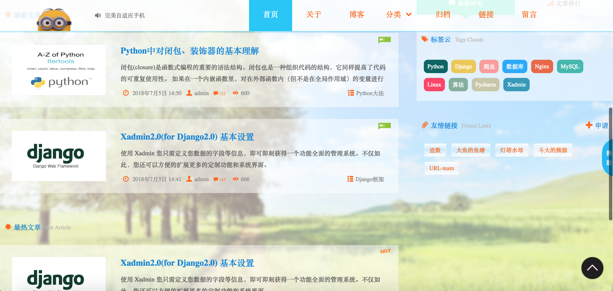

## Django搭建个人博客
 
  []()
[](http://www.cnblogs.com/wendaobiancheng/)

使用Django快速搭建博客
### 环境
* Python: 3.X
* Django: 2.0.x
* MySQL

### 示例博客：<http://www.mylanbitou.top>
### 后台搭建教程及常见问题分析（计划中，暂未更新）：<http://www.zxdt.fun/article/p2/0/>

### 特点

* 博客文章 `markdown` 渲染，代码高亮
* 第三方社会化评论系统支持(畅言)
* 三种皮肤自由切换
* 全局搜索
* 阅读排行榜/最新评论
* 多目标源博文分享
* 博文归档
* 友情链接
* 分享、打赏功能

### 下载
```
git clone https://github.com/myminwang/myblog.git
```

### 安装
```
pip install -r requirements.txt  #安装所有依赖
setting.py配置自己的数据库
配置畅言：到http://changyan.kuaizhan.com/注册站点,将templates/message.html中js部分换成你在畅言中生成的js。
python manage.py makemigrations
python manage.py migrate
python manage.py runserver
```

浏览器中打开<http://127.0.0.1:8000/>即可访问

## Screen Shots

* 首页


* 文章列表


* 文章内容

